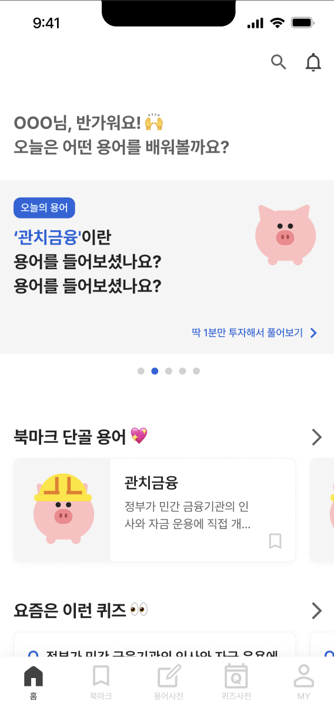
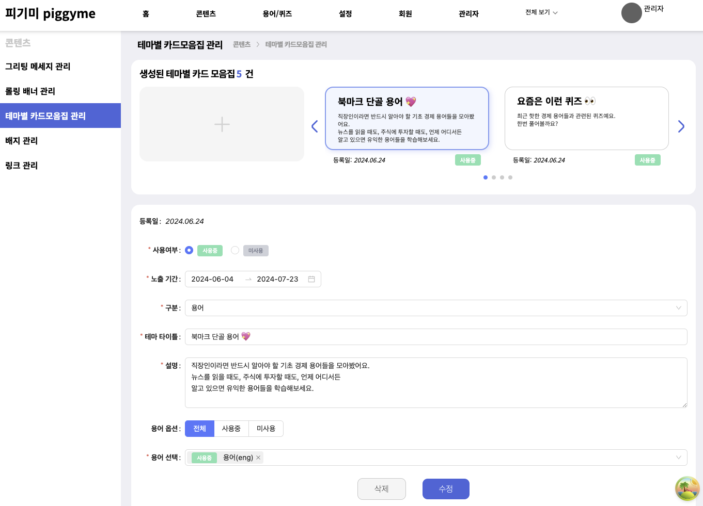

# 경제 용어 학습 서비스 피기미 Admin

<p align="center">
</p>
출처: https://0soo.tistory.com/227 [Lifealong:티스토리]
<br>

## 서비스 소개

🐷 **Piggy + Economy + Me : 내 손 안의 경제 용어 사전**

피기미는 경제 용어를 학습할 수 있는 웹 애플리케이션입니다. 경제와 돈을 연상시키는 돼지를 모티브로 하여, 사용자의 경제 지식을 살찌우는 것을 목표로 합니다.

_Piggy(돼지) + Economy (경제) + Me(나) = Piggyme (피기미)_

피기미는 경제 용어들을 사전처럼 한 곳에 모아 제공하며, 관련된 자료와 함께 학습을 즐겁게 할 수 있는 퀴즈 기능도 제공합니다.

## 기술 스택


## 팀원

|  |  |  |
| :----------------------------------------------------------------------------------------: | :----------------------------------------------------------------------------------------: | :----------------------------------------------------------------------------------------: |
|                      탁재민<br/>[@zockq1](https://github.com/zockq1)                       |                   윤희구<br/>[@heegu0311](https://github.com/heegu0311)                    |             강민혁<br/>[@kangminhyuk1111](https://github.com/kangminhyuk1111)              |

## 프로젝트 구조

```
app──기본 Next App Router 구조
share
  ├── query: react query 관련 hook
  ├── layout: 레이아웃 관련 공용 컴포넌트
  ├── ui: 버튼, 메뉴, 콘텐츠 박스 등 기본 UI 컴포넌트
  ├── util: 공용 유틸리티 함수 모음
  ├── 기타 기능별 폴더
type
```

## 개발

### 0. 공용 컴포넌트

- 탁재민
  - button, list-item(배너, 뱃지, 카드, 테마, 코멘트 등), post 컴포넌트 구현
  - 레이아웃 시스템 구현(https://tak-fe.tistory.com/48)
- 윤희구
  - breadmrumb, content-box, segmented, title 컴포넌트 구현
- 강민혁
  - 헤더, 사이드 메뉴 구현

### 1. 로그인, 홈 화면


- 탁재민
  - JWT 인증 로직 구현
    - 쿠키를 이용한 Next 서버와의 인증 상태 공유
    - axios를 이용한 refresh 인증 로직 구현
  - 홈 화면 UI 구현
- 강민혁
  - 로그인 UI 구현

### 2. 콘텐츠


- 탁재민
  - 그리팅 메시지 관리 페이지 구현
  - 배너 관리 페이지 구현
  - 카드 모음집 페이지 관리 구현
  - 링크 관리 구현(진행중)

### 3. 용어/퀴즈


- 윤희구
  - 용어 관리 페이지 구현
  - 퀴즈 관리 페이지 구현

### 4. 설정(개발 예정)

### 5. 회원(개발 예정)

### 6. 관리자(개발 예정)
