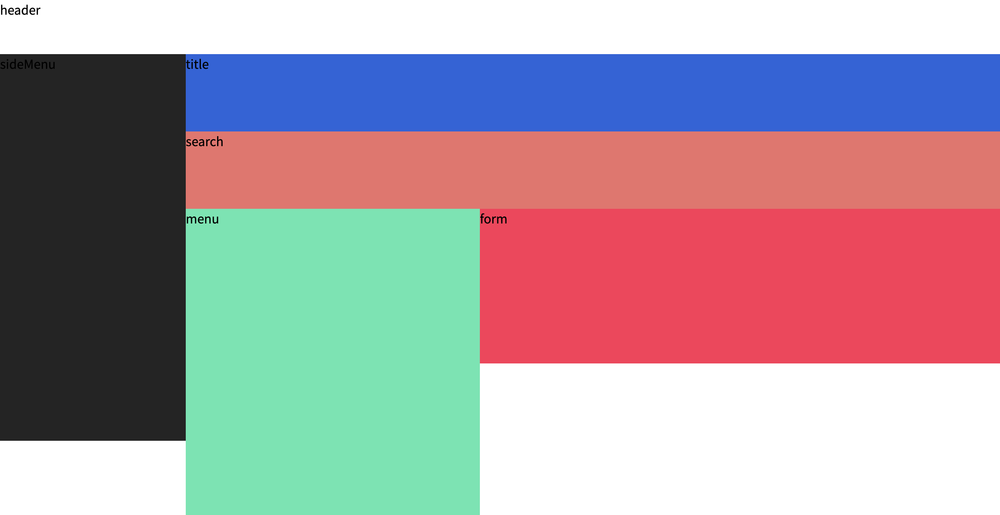
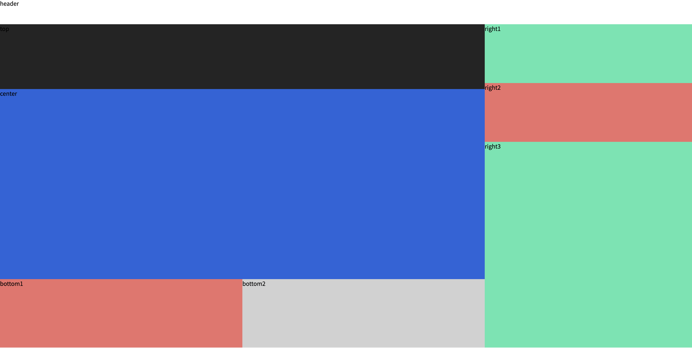
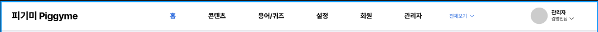
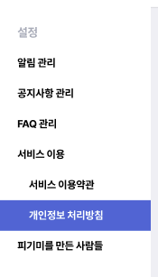
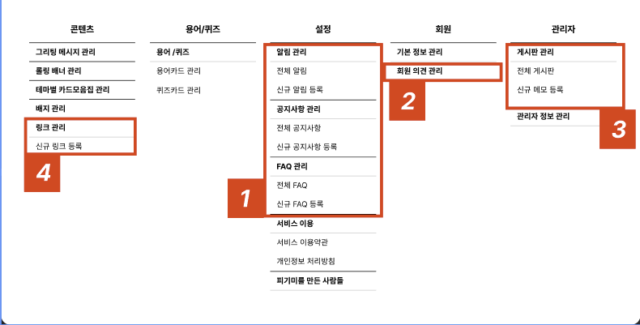

# Layout

## 목차

1. [Home](#button)
2. [전체](#title)

## 전체



```js
<Layout>
  <Header />
  <Layout.LeftSideMenu>
    <div className="h-[500px] bg-gray-1">sideMenu</div>
  </Layout.LeftSideMenu>
  <Layout.ContentLayout>
    <Layout.ContentLayout.Full>
      <div className="h-[100px] bg-primary">title</div>
    </Layout.ContentLayout.Full>
    <Layout.ContentLayout.Full>
      <div className="h-[100px] bg-warning">search</div>
    </Layout.ContentLayout.Full>
    <Layout.ContentLayout.Left>
      <div className="h-[700px] bg-secondary">menu</div>
    </Layout.ContentLayout.Left>
    <Layout.ContentLayout.Right>
      <div className="h-[200px] bg-error">form</div>
    </Layout.ContentLayout.Right>
  </Layout.ContentLayout>
</Layout>
```

## Home



```js
<HomeLayout>
  <Header />
  <HomeLayout.Top>
    <div className="h-full bg-gray-1">top</div>
  </HomeLayout.Top>
  <HomeLayout.Center>
    <div className="h-full bg-primary">center</div>
  </HomeLayout.Center>
  <HomeLayout.Bottom>
    <div className="h-full bg-warning">bottom1</div>
    <div className="h-full bg-gray-5">bottom2</div>
  </HomeLayout.Bottom>
  <HomeLayout.Right>
    <div className="h-full bg-secondary">right1</div>
    <div className="h-full bg-warning">right2</div>
    <div className="h-full bg-secondary">right3</div>
  </HomeLayout.Right>
</HomeLayout>
```

## Header



## SideMenu



## Popup


## TotalMenu


