# UI

## 목차

1. [Button](#button)
2. [Title](#title)
3. [Content Box](#content-box)
4. [Modal](#modal)
5. [Dropdown](#dropdown)
6. [Table](#table)
7. [List](#list)
8. [Form](#form)
9. [Search](#search)

## Button

1. `<IconButton/>`<br/>
   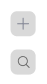

   - 설명: 아이콘이 표시된 버튼
   - Props:<br/>
     - children: ReactNode (필수) - 표시할 아이콘<br/>
     - onClick: () => void - 버튼 클릭 시 실행할 콜백 함수<br/><br/>

2. `<Button/>`<br/>
   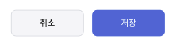
   

   - 설명: 일반 버튼
   - Props:
     - children: ReactNode (필수) - 버튼에 표시할 내용
     - size: 'small' | 'large' (기본값: 'small') - 버튼의 크기
     - color: 'blue' | 'gray' | 'white' (기본값: 'blue') - 버튼의 색상
     - onClick: () => void - 버튼 클릭 시 실행할 콜백 함수<br/><br/>
   - small 사이즈는 Modal, large 사이즈는 Form에 주로 사용됩니다.
   - 의견: 저장 등 클릭 시 로딩이 있는 경우에는 로딩 애니메이션을 추가하는것도 좋아 보입니다.

3. `<MoreButton/>`<br/>
   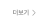
   - 설명: 자주 사용되는 더보기 버튼
   - Props:
     - onClick: () => void - 버튼 클릭 시 실행할 콜백 함수<br/><br/>

## Title

1. `<Title/>`<br/>
   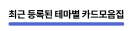
   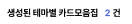

   - Props:
     - underbar: boolean (기본값: false)
     - children: ReactNode (필수) - 타이틀에 표시할 내용
   - Attr:
     - `<Title.H/>`: 해당 Attr로 감쌀 시 하이라이트
   - 예시:
     - `<Title underbar>테마별 카드 모음집</Title>`
     - `<Title underbar>카드 모음집 <Title.H>2</Title.H>건</Title>`

2. `<Breadcrumb/>`<br/>
   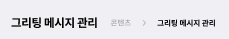
   - Props:
     - path: string[] - 경로를 순차적으로 전달, 마지막 index가 현재 페이지
3. `<Segmented/>`<br/>
   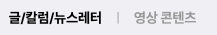
   - Props:
     - categoryList: {title: string, onClick: () => void, current: boolean}[] - 카테고리 목록과 클릭 이벤트, 현재 페이지를 전달

## Content Box

1. `<ContentBox/>`
   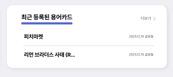

   - 내용물 제외한 흰색 박스
   - 너비는 부모 layout에 맞춤
   - 높이는 디폴트로 max-content, 사용자 설정도 가능
   - 좌상단과 우상단에 요소 배치 가능해야 하고, 해댱 영역에 배치된 요소 없을 시에는 공간 차지하면 안됨

   - Props:
     - children: ReactNode
     - topLeft: ReactNode
     - topRight: ReactNode
     - height: string | number;

## Modal

0. `<Modal/>`

   - 아래 두 Modal의 중복되는 부분인 overlay(클릭 시 모달 off), contentbox 등 구현 후 아래 Modal에서 사용

1. `<NoticeModal/>`<br/>
   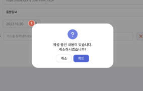
   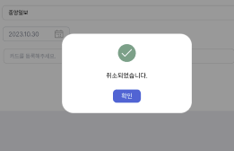
   - 아이콘, 설명, 하단 버튼 포함
   - Props:
     - children: ReactNode - 설명
     - icon: string
     - onSubmit: () => void (필수)
     - onCancel: () => void - 없을 시 취소 버튼 출력 안함
2. `<ContentModal/>`<br/>
   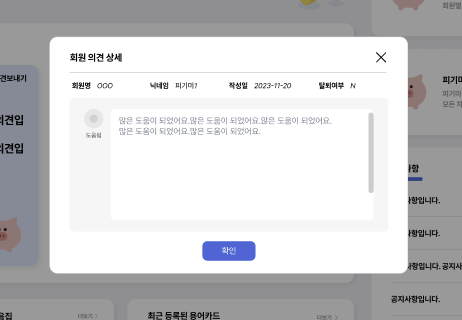
   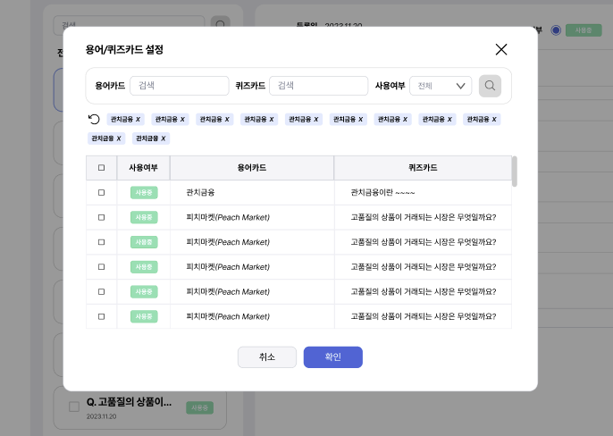
   - title, x 버튼, 하단 버튼, 내부 children 컴포넌트 포함
   - Props:
     - title: string - 제목
     - children: ReactNode - 내용
     - onSubmit: () => void (필수)
     - onCancel: () => void - 없을 시 취소 버튼 출력 안함

## Dropdown

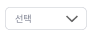
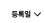

- 기본 select, option 사용

## Table

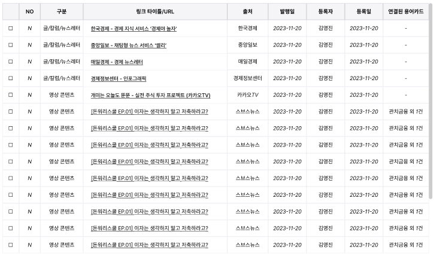
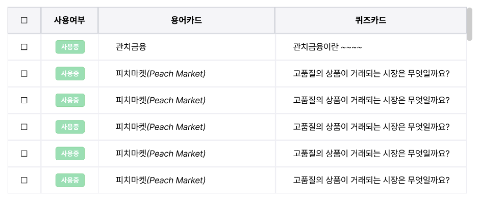
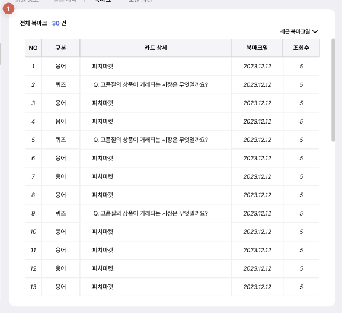

- 예시:

```javascript
<Table>
  <TableHead>
    <Row>
      <Head>No</Head>
      <Head>구분</Head>
      <Head>카드 상세</Head>
      <Head>북마크일</Head>
      <Head>조회수</Head>
    </Row>
  </TableHead>
  <TableBody>
    {rows.map((row) => (
      <Row key={row.name}>
        <Cell>{row.no}</Cell>
        <Cell>{row.category}</Cell>
        <Cell>{row.detail}</Cell>
        <Cell>{row.bookmarkDate}</Cell>
        <Cell>{row.view}</Cell>
      </Row>
    ))}
  </TableBody>
</Table>
```

## List

1. `<HrizontalList/>`<br/>
   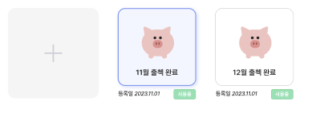
   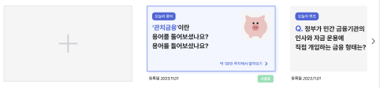
   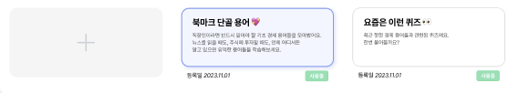

   - 선택된 요소 하이라이트
   - 좌측 추가 버튼
   - 좌우 스크롤 가능해야 함
   - Attr:
     - `<VerticalList.Add/>`: 클릭 시 생성 페이지로 이동
     - `<VerticalList.Badge/>`: 뱃지
     - `<VerticalList.Banner/>`: 배너
     - `<VerticalList.card/>`: 카드

2. `<VerticalList/>`<br/>
   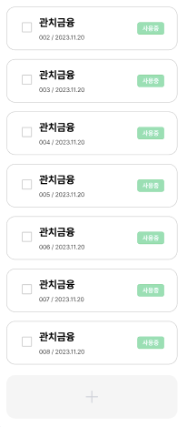

   - 선택된 요소 하이라이트
   - 하단 추가 버튼
   - 상하 스크롤 가능해야 함(추가 버튼 예외)
   - checkbox 클릭 시에는 onClick 이벤트가 발생하지 않아야 함
   - Attr:
     - `<VerticalList.Add/>`: 클릭 시 생성 페이지로 이동
     - `<VerticalList.Card/>`: 카드

3. `<PostList/>`<br/>
   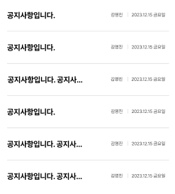
   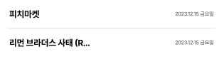

   - 제목, 작성자(선택), 시간 출력
   - 제목 클릭 가능하게
   - Attr:
     - `<PostList.Post/>`: 개별 포스트, 사이에 구분선

## Form

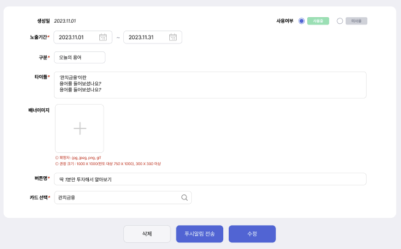
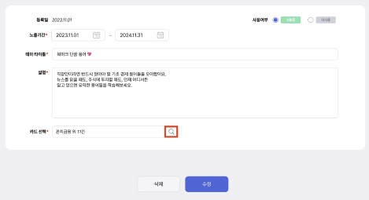
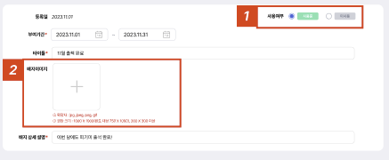
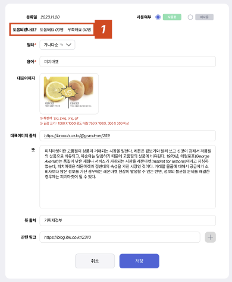
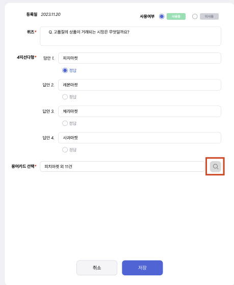
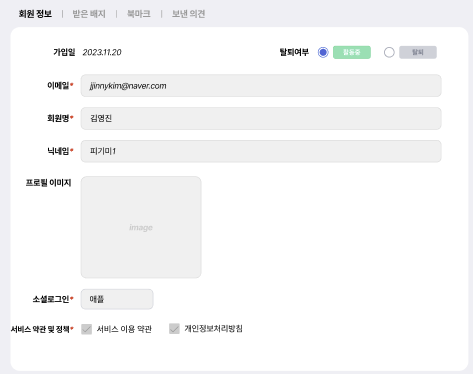
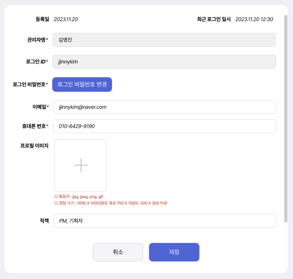

- 아래 각 Attr은 필수 여부, 활성화 여부 선택 가능
- 아래 각 Attr은 label을 props로 받아 위 예시 처럼 정렬
- React-hook-form과 연계 가능하면 좋을듯
- Attr:
  - `<Form.ActiveRadio/>`: 사용여부, 우상단 고정
  - `<Form.Date/>`: 등록일, 수정 불가
  - `<Form.TextArea/>`: 높이 설정 가능
  - `<Form.DatePicker/>`: startDate, endDate 설정
  - `<Form.Image/>`: 이미지 업로드
  - `<Form.Choice/>`: 4지선다형
  - `<Form.Dropdown/>`: 드롭다운
  - `<Form.Link/>`: 관련 링크
  - `<Form.CardSelect/>`: 카드 선택

## Search

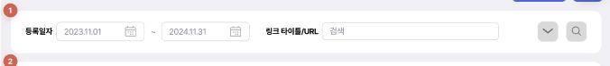
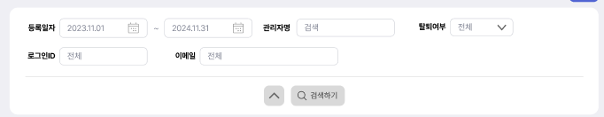
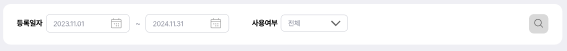
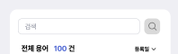

- form의 props에 수직, 수평 선택을 추가해서 사용
